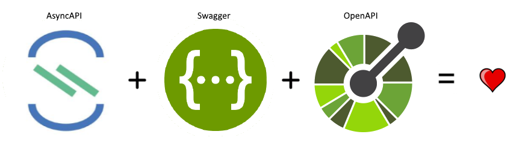
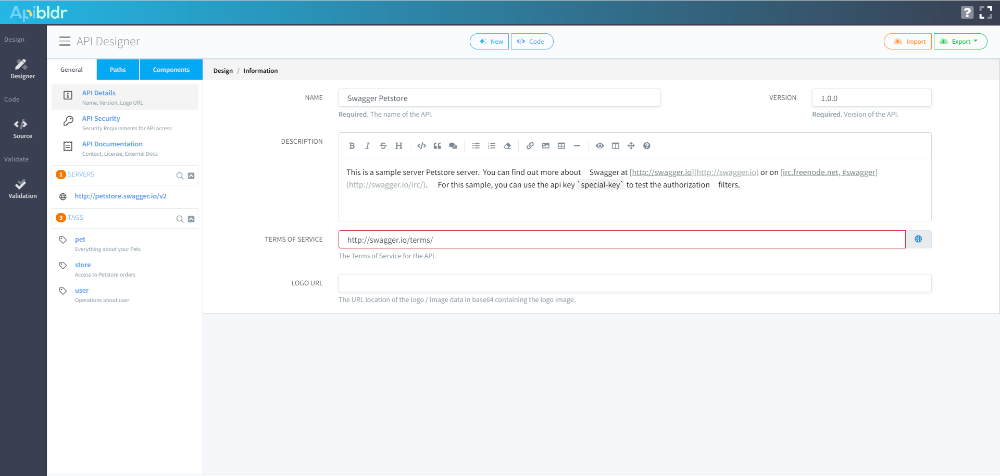

# ApiBldr - Visual API Designer

ApiBldr is an application for API design and modeling. A primary goal of ApiBldr is enable the API-First design approach and to make it in a visual manner so that even non-programmers.

## Full Support for Swagger v2, OpenAPI v3, AsyncAPI v2

ApiBldr comes with full support for the OpenAPI versions 2 (swagger) and 3 specification formats for all functionality except links and callbacks and also a support for AsyncAPI specificaiton. 

## Graphical API Design

Form-based designing means you don't need to be an OpenAPI expert to get started. ApiBldr has a "write" (code) mode with full OpenAPI autocomplete, and a "read" mode for visualizing HTTP operations and models.

To find out more about how you can quickly design and prototype APIs without writing a single line of JSON or YAML, see (TODO: Add link here).

## JSON Schema Modeling

ApiBldr is not just for APIs, you can also create and modify standalone JSON Schema files for storing data models.

## Encourage Reuse, Avoid Duplication

When it comes to API modeling, avoiding duplication of effort can be the difference between success and failure.

ApiBldr allows you to quickly and easily find and reuse the objects you need, as you need them. No more recreating models for different endpoints, no more having to update dozens of different endpoints because a new field was added.

## Markdown

ApiBldr enables a few advanced block types that will enrich your user’s documentation experience.

